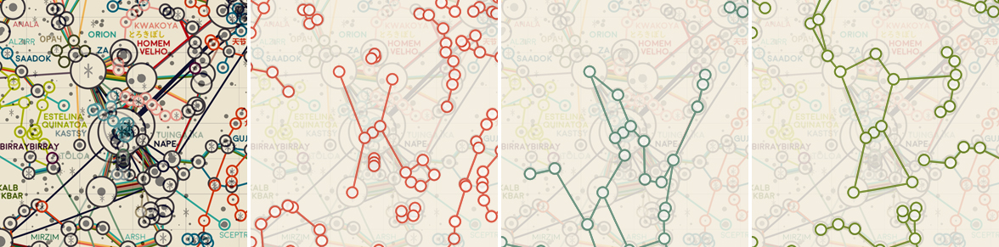
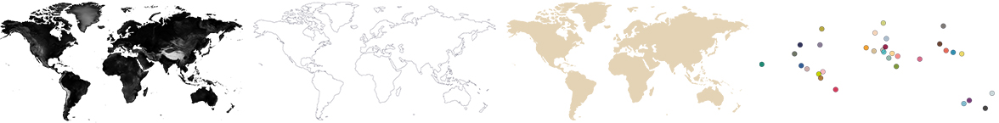
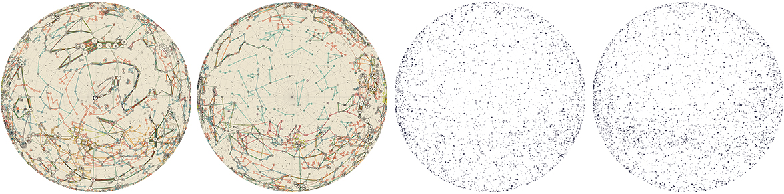
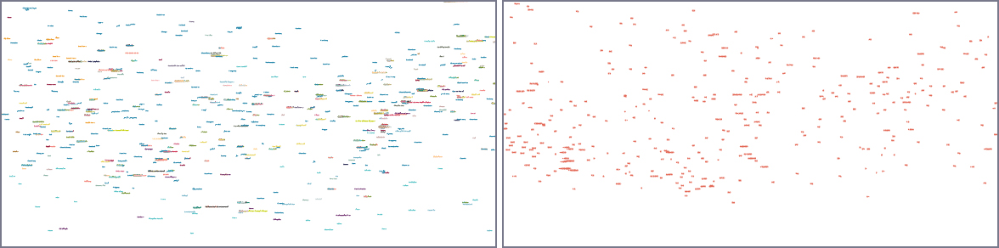
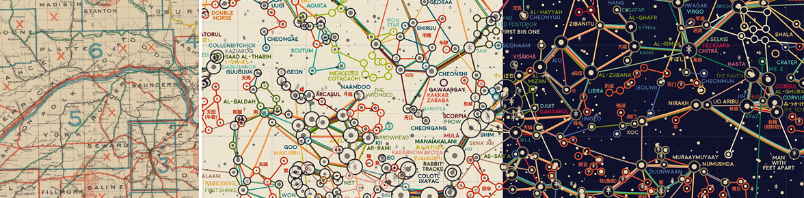

# Constellations from Around the World

[](https://www.gnu.org/licenses/gpl-3.0)
[](https://twitter.com/eleanor_lutz)
[](https://github.com/eleanorlutz)

This repository explains how to make a map of constellations from cultures around the world, using data from [Stellarium](https://stellarium.org/) and the [HYG Database](http://www.astronexus.com/hyg) (Hipparcos, Yale Bright Star, and Gliese catalogs). Software used includes `Python 3.7.1`, `Illustrator CC 2019` and `Photoshop CC 2019`. If you have comments or suggestions for this tutorial, please let me know [on my blog](http://tabletopwhale.com/2019/07/29/the-world-constellations.html)! You can also buy the [finished map here](https://www.redbubble.com/people/eleanorlutz/works/39436391) if you like.

**Python dependencies:** `matplotlib` `numpy` `cartopy` `pandas` `glob` `os` `jupyter`. Dependencies can be installed with `pip install -r requirements.txt`.


## Special instructions for beginners

##### If you're new to coding:

[Software Carpentry](https://software-carpentry.org/) has great tutorials for [installing Python](https://carpentries.github.io/workshop-template/) (scroll down and follow the directions in  the Bash Shell and Python sections), [getting starting with Jupyter Notebooks](http://swcarpentry.github.io/python-novice-inflammation/setup/index.html), and [beginner-friendly Python programming](http://swcarpentry.github.io/python-novice-inflammation/aio/index.html). After you've installed Python using these tutorials, you can use [Git Desktop](https://desktop.github.com/) and the instructions in [this tutorial](https://help.github.com/en/desktop/contributing-to-projects/cloning-a-repository-from-github-desktop) to download the code and data in this tutorial.

##### If you're new to design:

You'll need software for editing raster and vector images ([this article](https://vector-conversions.com/vectorizing/raster_vs_vector.html) explains the difference). I use [Adobe Photoshop](https://www.adobe.com/products/photoshop.html) and [Illustrator](https://www.adobe.com/products/illustrator.html), but you can also use the free open-source programs [Gimp](https://www.gimp.org/downloads/) and [Inkscape](https://inkscape.org/release/inkscape-0.92.4/). There is no perfect software that fits everyone's needs, so you'll want to understand the pros and cons for the different [raster](https://www.colorexpertsbd.com/blog/brief-comparison-photoshop-gimp) and [vector](https://logosbynick.com/inkscape-vs-illustrator-vs-coreldraw/) programs before choosing.

## Table of Contents

1. [Gathering and processing data](#data)
2. [Map design in Python](#python)
3. [Map design in Illustrator and Photoshop](#illustrator_photoshop)
4. [References](#references)
5. [License](#license)

<a name="data"/>

## Gathering and processing data

#### Stars

To map these stars I used David Nash's [HYG Database version 3](http://www.astronexus.com/hyg), which combines all stars from the Hipparcos, Yale Bright Star, and Gliese catalogs. This dataset provides the *right ascension* (RA) and *declination* (DEC) for each star - the celestial equivalent of longitude and latitude - as well as the spectral class, magnitude, name, ID number, and various other measurements. I edited the original dataset in `1_process_starbase_data.ipynb` to only include visible stars (magnitude <= 6.5).

#### Asterisms from Around the World

What we call "constellations" in popular English are actually unofficial shapes called asterisms (examples from Arabic and Korean cultures shown below). I downloaded these asterisms from [Stellarium](https://github.com/Stellarium/stellarium), an open-source planetarium software. In the Stellarium Git repository, these asterisms are found in the `skycultures` folder as the file `constellationship.fab` and `constellation_names.eng.fab` for each culture. This data is provided as a list of star ID numbers that should be connected to form each of the lines in the asterisms. To plot the asterisms on a map, I matched each star ID number to the same entry in the HYG Database, and converted ID number into RA and DEC location values for each asterism vertex.


The stars around the Western constellation Orion are one of the busiest places on the map. Some of the individual cultures are highlighted below, including the Chinese constellations in red, ancient Egyptian in turquoise, and Arabic in green. I really liked that each of these cultures included the triple stars in “Orion’s belt”, but still interpreted the star patterns in a completely different design.



#### Earth Homes

I also wanted to map each of the cultures on the Earth to show where each group of people were from. For this map I used vector data from `cartopy` to plot the coastline of all continents. I also used [topography data](https://neo.sci.gsfc.nasa.gov/view.php?datasetId=SRTM_RAMP2_TOPO) downloaded from the [NASA Near-Earth Observations](https://neo.sci.gsfc.nasa.gov/) website to add a subtle texture to the basic shape outline.

For many of the cultures, especially the ancient ones, it was difficult to pick an exact location to use for this map. So I decided to use very large markers to show just the approximate location. The exact data points used in the `colormap.csv` dataset are based off of cities that were probably or definitely a part of that culture, and don't necessarily show the most important city.



#### Map Projections
I used a Plate Carrée projection for this map, because the perpendicular gridlines make it easy to read coordinates (which are useful for finding stars that rise and set throughout the night). However, Plate Carrée tends to distort maps quite a bit, so it's rarely used. The same code in this repository can be used to create maps in any other [supported projection](https://scitools.org.uk/cartopy/docs/latest/crs/projections.html) by changing the axis projection variable `plt.axes(projection=cartopy.crs.PlateCarree())`.


To show the stars and asterisms near the North and South poles - which are distorted particularly heavily in Plate Carrée - I also included two inset maps at the bottom of the design in an Orthographic projection. There's no real difference in the design steps used to make these two additional maps, except for changing the projection in Python before plotting.



<a name="python"/>

## Map design in Python

To make the central Plate Carrée map I combined about 5 Python-generated maps (asterisms, gridlines, stars, star labels, and asterism labels). I often split up data for plotting so I can easily apply section-specific effects in Photoshop or Illustrator (in this map I heavily edited the text labels in Illustrator). The plotting code for all of these maps are shared in `5_plot_maps.ipynb`.

#### Star sizes
This map plots the size of each star based on its magnitude, or the relative brightness as seen from Earth. Star magnitude doesn’t measure the actual size of the star, so it’s possible for a small star to have a larger magnitude than a massive star if the smaller star is closer to Earth. To select just visible stars I picked only stars with a magnitude <= 6.5 out of the HYG Database.

#### Different Languages in Matplotlib
In this map I wanted to label each constellation in that culture's language, if possible. Not all constellations are fully translated in the original Stellarium data, but I did the best I could by including Chinese labels, which were already fully translated, and by adding phonetic ひらがな labels for Japanese moon signs (I speak Japanese). I made two different output files in Python, one plotting the non-Chinese labels in the default font, and a second file plotting just the Chinese labels in a font that supported Chinese characters.



#### Great circle distance
The lines connecting each of the stars in this map visualizes the *great circle distance*, which is the shortest path between the two points on a globe. These lines don't always look straight on the map, because the 2D map projection distorts the actual spherical 3D data. To illustrate, all the black lines in the Earth examples below show the great circle distance between the same two points. The red line visualizes how a line that *appears* straight on a Plate Carrée projection (far left) is not actually straight.


#### Shifting Constellation Vectors

One of the challenges for this map was illustrating the many overlapping lines between stars. Because the great circle distances are not straight lines, and because the lines are distorted differently at each latitude and longitude, it was difficult to find an easy way to align each line. In the end I just shifted each of the shared lines one unit sideways and one unit vertically. This meant that the ends of each line were very messy, but I covered these up by outlining each star with a circle proportional to the number of cultures.

To shift each of the vectors by the correct amount, I broke down each of the asterisms into individual two-star pairs in `2_process_asterism_locations.ipynb`. By storing the data in this format, I could easily find the number of lines to plot for each star pair, and center the shifted vectors appropriately. I also used a different data structure to store individual stars and the cultures referencing that star. This dataset, formatted in `2_process_asterism_locations.ipynb`, was used to plot the circles outlining each star marking the number of cultures.

#### Saving Matplotlib figures

I usually save figures as a PDF so I can edit the text and shapes in Illustrator. There are a couple standard commands I use to export Matplotlib figures so they're easy to edit:

```python
import matplotlib
import matplotlib.pyplot as plt
import matplotlib.backends.backend_pdf as pdf

# Export text as editable text instead of shapes:
matplotlib.rcParams['pdf.fonttype'] = 42

# Preserve the vertical order of embedded images:
matplotlib.rcParams['image.composite_image'] = False

# Remove borders and ticks from subplots:
ax.axis('off')

# Remove padding and margins from the figure and all its subplots
plt.margins(0,0)
plt.subplots_adjust(top=1, bottom=0, right=1, left=0, hspace=0, wspace=0)
plt.gca().xaxis.set_major_locator(plt.NullLocator())
plt.gca().yaxis.set_major_locator(plt.NullLocator())

# Save the Matplotlib figure as a PDF file:
pp = pdf.PdfPages('./savename.pdf', keep_empty=False)
pp.savefig(fig)
pp.close()

# If I don't need to edit vector paths I save the file as a
# PNG so I can import it directly into Photoshop:
plt.savefig('./savename.png', format='png', dpi=600, pad_inches=0, transparent=True)
```

After saving the figure, the `PDF` file needs to be edited so that each object can be manipulated individually. In Illustrator,  select everything in the file and then go to `Object` --> `Clipping Mask` --> `Release`. At this point you can also delete the background and axis border objects, if you included them in the output file.

<a name="illustrator_photoshop"/>

## Map design in Illustrator and Photoshop

I export Python figures to Illustrator and Photoshop because several great design features are impossible or very time-consuming in Matplotlib. I'm linking tutorials here for the features I use most often - [font alternates](https://helpx.adobe.com/illustrator/using/special-characters.html) and [ligatures](https://helpx.adobe.com/illustrator/using/special-characters.html#use_ligatures_and_contextual_alternates), [custom brushes](https://helpx.adobe.com/illustrator/using/brushes.html), [layering effects](https://helpx.adobe.com/photoshop/using/layer-effects-styles.html), [blur effects](https://helpx.adobe.com/photoshop/using/blur-gallery.html), [gradients along a path](http://blog.gilbertconsulting.com/2017/06/using-gradients-on-strokes-in.html), [variable width paths](https://iamsteve.me/blog/entry/creating-custom-stroke-width-profiles-in-illustrator), [type on a path](https://helpx.adobe.com/illustrator/using/creating-type-path.html), and [selecting objects by characteristic](https://helpx.adobe.com/illustrator/using/selecting-objects.html#select_objects_by_characteristic).


#### Layering in Photoshop

I've included a small section of the map in the `figures` folder as the Photoshop file `worldstars_sample.psd`. It still has the original layers, so you should be able to use it as a reference for layering and color effects.


#### Shadows and Glow Effects

To create a glow effect around the asterisms, duplicate the asterism color layer and go to `Filter` --> `Blur Gallery` --> `Field Blur`. For glowing text or objects I usually create two blur layers set to 20% opacity - one with a `Blur` of 4px and the other 10px. In this map I added a glow effect to the text labels and all of the asterisms.

I also added a light shadow underneath the text labels to make them easier to read. You can make this shadow effect in almost exactly the same way as the glow effect: Before applying the `Field Blur`, change the color of all text objects in the duplicated layer to the color you'd like to use for the shadow. I think it's easiest to change the colors in the original Illustrator image instead of in Photoshop (especially for text and complex object shapes).

#### Color and Font

I wanted the maps in this series to look cohesive, so I made a palette of ~70 different colors and picked from these choices in every map. I also used the same two fonts ([Redflowers](https://creativemarket.com/TypeandStudio/923689-RedFlower-Typeface) and [Moon](https://harvatt.house/store/moon-font)) in all maps. You're welcome to use the color palette and font styling if you'd like.


The color scheme for this map was inspired by antique roadmaps, like this [map of Nebraska from 1898](https://digitalcollections.nypl.org/items/bc714ed0-d20a-0135-4b9b-01353a5bb56c#/?uuid=946933d0-f308-0135-41ac-08b588ddd627). But this is the only map in the series without a dark background, and I wasn’t quite convinced that a lighter background could work for a star map. I even made two different versions before finally deciding to stick with the original color scheme.



<a name="references"/>

## References

- [Astronomy](https://openstax.org/details/astronomy). Andrew Fraknoi, David Morrison, Sidney C. Wolff et al. OpenStax 2016.
- [HYG Database version 3](http://www.astronexus.com/hyg). David Nash. 2019.
- [Stellarium](https://stellarium.org/) 2019 version 0.19.0.
- **Fonts:** [Moon](https://harvatt.house/store/moon-font) by Jack Harvatt and [RedFlower](https://creativemarket.com/TypeandStudio/923689-RedFlower-Typeface) by Type & Studio.
- **Advice:** Thank you to Nadieh Bremer, Oliver Fraser, Chloe Pursey, and Leah Willey for their helpful advice in making this map.

<a name="license"/>

## License

**Code:** All of the code in this repository is shared under the [GPL-3.0 license](https://www.gnu.org/licenses/gpl-3.0).

**Data:** The data in this repository belongs to the original authors of the data. Please use the references section to look up the original version. In cases where I edited or revised the data, I impose no additional restrictions to the original license. Any data files I created myself are shared under the [ODC Open Database License](https://opendatacommons.org/licenses/odbl/summary/).

**Artwork:** The artwork included in this repository are shared under a [Creative Commons Attribution-NonCommercial-NoDerivatives 4.0 International License](https://creativecommons.org/licenses/by-nc-nd/4.0/).
